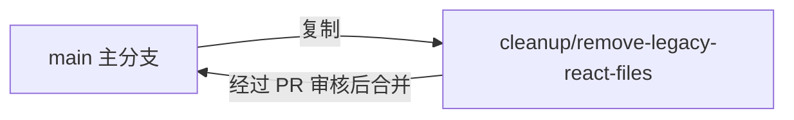

# 🧹 GitHub 旧文件清理完整教程

> **适用对象**：第一次接触 Git/GitHub 的编程小白
>
> **难度等级**：⭐️⭐️☆☆☆（入门级，带指导）
>
> **预计用时**：35 ~ 60 分钟（视网络和电脑环境而定）
>
> **参考依据**：基于 `docs/CLEANUP_FILE_LIST.md`（commit `159d627`）中列出的旧文件清单

---

## 0. 任务背景与清理范围
完成 Vue 3 重构后，仓库中仍保留了旧的 React 代码、临时脚本和重复文档。这份教程将手把手指导你在 **GitHub** 上安全地删除这些旧文件，并通过 **Pull Request**（简称 PR）合并回主分支。

### 0.1 要删除的文件与原因概览
| 分类 | 路径 | 说明 |
| ---- | ---- | ---- |
| 旧备份目录 | `mvu-generator/backup/react-components/` | React 时代的备份组件，现已被 Vue 版本替代 |
| 旧组件代码 | `mvu-generator/src/components/*.jsx`<br>`mvu-generator/src/components/PreviewSandbox.css` | 旧的 React 组件和样式文件，Vue 版本已覆盖 |
| 临时脚本 | `mvu-generator/test-imports.js`<br>`mvu-generator/test-layout.sh`<br>`mvu-generator/test-setup.sh`<br>`mvu-generator/verify-setup.mjs` | 为迁移过程准备的检查脚本，现已无用 |
| 重复文档 | `mvu-generator/IMPLEMENTATION_CHECKLIST.md`<br>`mvu-generator/LAYOUT_IMPLEMENTATION.md`<br>`mvu-generator/PREVIEW_SANDBOX_README.md` | Vue 文档已经替代，避免信息重复 |
| 冗余工具函数 | `mvu-generator/src/utils/workspace.js` | 与 `workspace.ts` 重复，保留 TS 版本即可 |

---

## 1. 前置准备
这一步确保你的电脑可以顺利执行后续命令。

### 1.1 环境要求
- 一台可以运行终端（Terminal / 命令提示符）的电脑
- GitHub 账号，并对目标仓库有推送（push）权限
- 稳定的网络连接

### 1.2 安装 Git
| 操作系统 | 推荐安装方式 |
| -------- | -------------- |
| Windows | 访问 [https://git-scm.com/download/win](https://git-scm.com/download/win)，下载并安装。安装时勾选“添加到 PATH”。 |
| macOS | 打开终端执行 `xcode-select --install` 或者使用 Homebrew：`brew install git`。 |
| Linux | 使用包管理器，例如 Ubuntu 执行 `sudo apt update && sudo apt install git`。 |

安装完成后，在终端输入以下命令确认安装成功：
```bash
git --version
```
看到 `git version ...` 字样即表示安装成功。

### 1.3 配置 Git 身份（首次使用必做）
```bash
git config --global user.name "你的名字"
git config --global user.email "你的邮箱"
```
如果已经配置过，可以跳过。本仓库只要求你的提交记录能对应到你本人。

### 1.4 获取或更新项目代码
1. **首次参与**：克隆仓库
   ```bash
   git clone git@github.com:<your-org>/<your-repo>.git
   cd <your-repo>
   ```
   > 如果没有配置 SSH，可以使用 HTTPS：`git clone https://github.com/<your-org>/<your-repo>.git`。

2. **已经克隆过**：拉取最新代码
   ```bash
   cd <your-repo>
   git fetch origin
   git checkout main
   git pull origin main
   ```

### 1.5 快速健康检查
在仓库根目录输入：
```bash
git remote -v        # 确认远程仓库可用
git status           # 应显示 “nothing to commit, working tree clean”
ls mvu-generator      # 确认核心目录存在
```
如果 `git status` 显示有本地未提交的改动，请先处理（提交或还原），再继续后续步骤。

---

## 第 1 步：创建清理分支

### 1.1 什么是“分支”？
- **分支（Branch）** 是 Git 中的一条独立开发线路。
- 可以把它理解为“在主线 `main` 上复制一个安全的工作副本，然后在副本里做实验”。
- 我们会在新分支上删除文件，待验证无误后再合并回 `main`。



### 1.2 实际操作命令
在仓库根目录依次执行：
```bash
git checkout main
git pull origin main
git checkout -b cleanup/remove-legacy-react-files
```
执行完毕后，使用 `git status -sb` 检查：
```
## cleanup/remove-legacy-react-files
```
看到当前分支名称就是新分支，说明创建成功。

> ✅ 如果你希望分支名字不同，也可以自行替换，但请保持全程一致。

---

## 第 2 步：执行删除文件命令
这一阶段会批量删除旧文件。**所有命令请在仓库根目录执行**。

### 2.1 建议先确认一下要删除的目标是否还存在
```bash
ls mvu-generator/backup/react-components
ls mvu-generator/src/components/*.jsx
ls mvu-generator/src/utils | grep workspace
```
> 如果某条命令提示 “No such file or directory”，说明该文件已经被删除过，可在后续命令中去掉对应行。

### 2.2 一键删除并标记到 Git（复制整段即可）
```bash
# 1) 确保在仓库根目录（如已在根目录可忽略本行）
cd "$(git rev-parse --show-toplevel)"

# 2) 删除旧备份目录
git rm -rf mvu-generator/backup/react-components

# 3) 删除旧的 React 组件与样式
git rm mvu-generator/src/components/ChatInterface.jsx
git rm mvu-generator/src/components/CodeEditor.jsx
git rm mvu-generator/src/components/CodeWorkspace.jsx
git rm mvu-generator/src/components/HamburgerMenu.jsx
git rm mvu-generator/src/components/Layout.jsx
git rm mvu-generator/src/components/PreviewPanel.jsx
git rm mvu-generator/src/components/PreviewSandbox.jsx
git rm mvu-generator/src/components/SplitPane.jsx
git rm mvu-generator/src/components/VariableEditor.jsx
git rm mvu-generator/src/components/PreviewSandbox.css

# 4) 删除迁移过程中使用的临时脚本
git rm mvu-generator/test-imports.js
git rm mvu-generator/test-layout.sh
git rm mvu-generator/test-setup.sh
git rm mvu-generator/verify-setup.mjs

# 5) 删除重复的文档说明
git rm mvu-generator/IMPLEMENTATION_CHECKLIST.md
git rm mvu-generator/LAYOUT_IMPLEMENTATION.md
git rm mvu-generator/PREVIEW_SANDBOX_README.md

# 6) 删除冗余的 workspace.js（TypeScript 版本已取代）
git rm mvu-generator/src/utils/workspace.js
```
> 如果命令提示 “fatal: not a git repository (or any of the parent directories): .git”，说明当前终端不在仓库目录内，请先 `cd` 到仓库根目录后再执行上述命令。
> `git rm` 会同时删除文件并将删除动作纳入 Git 记录，比单纯 `rm` 更安全。

---

## 第 3 步：检查删除结果
确保没有误删并确认所有目标都被移除。

### 3.1 使用 Git 进行整体检查
```bash
git status -sb
```
输出应类似：
```
## cleanup/remove-legacy-react-files
D  mvu-generator/backup/react-components/App.jsx
...
```
`D` 代表删除（delete）。如果有 `??` 表示新增未跟踪文件，要确认是否误创建了其他文件。

### 3.2 查看差异统计
```bash
git diff --stat
```
你将看到删除的文件数量统计。也可以打开具体差异：
```bash
git diff
```

### 3.3 核实关键目录是否已被清空
```bash
ls mvu-generator/backup/react-components
ls mvu-generator/src/components/*.jsx
ls mvu-generator/src/utils | grep workspace
```
- 如果目录已经被删，`ls` 会提示不存在。
- `workspace.ts` 应该还在，`workspace.js` 不存在。

### 3.4（可选但推荐）快速运行项目自检
```bash
cd mvu-generator
npm install
npm run build
```
若 `npm run build` 成功且无报错，说明删除旧文件不会影响编译。

---

## 第 4 步：提交修改（git add & git commit）
这一阶段把删除操作正式记录为一次 Git 提交。

### 4.1 确认删除记录已被暂存
因为使用了 `git rm`，文件已经自动加入暂存区。为了保险，可以执行一次全量暂存：
```bash
git add -A
```

### 4.2 编写提交信息并提交
```bash
git commit -m "chore: remove legacy react files"
```
> 提交信息建议保持简洁、描述明确。你也可以根据团队规范更改消息内容。

提交后终端会输出提交摘要，确认删除文件数量无误。

---

## 第 5 步：推送到 GitHub（git push）
将本地分支上传到远程仓库，让同事能看到你的修改。

```bash
git push -u origin cleanup/remove-legacy-react-files
```
- `-u` 会把本地分支与远程分支关联，之后可直接 `git push`。
- 如果是 HTTPS 方式，需要输入 GitHub 用户名和密码（或个人访问令牌 PAT）。

推送成功后，终端会提示远程分支地址，并显示可访问的 PR 链接。

---

## 第 6 步：在网页上创建 PR 并合并
登录 GitHub，在仓库页面完成以下操作。

```text
┌─────────────────────── GitHub Pull Request 页面示意 ───────────────────────┐
│ ① Compare & pull request 按钮：推送成功后主页会出现绿色提示框              │
│ ② PR 标题输入框：保持与提交一致，如 “chore: remove legacy react files”      │
│ ③ PR 描述区域：可粘贴本教程关键点，说明清理范围和验证方法                  │
│ ④ Files changed 标签：检查所有删除项是否正确                              │
│ ⑤ Merge pull request 按钮：通过代码审查后点击，完成合并                    │
└───────────────────────────────────────────────────────────────────────────┘
```

### 6.1 创建 Pull Request
1. 打开仓库主页，点击绿色的 **“Compare & pull request”** 按钮。
2. 确认 `base` 分支为 `main`，`compare` 分支为 `cleanup/remove-legacy-react-files`。
3. 填写标题（建议与提交信息保持一致）。
4. 在描述里说明：
   - 删除了哪些旧文件（可粘贴本教程的“要删除的文件与原因概览”表格）。
   - 已执行的验证步骤（例如 `npm run build`）。
5. 点击 **“Create pull request”**。

### 6.2 代码审查与合并
1. 在 PR 页面的 **Files changed** 标签检查删除列表。
2. 如果团队需要 Review，@相关同事或分配 reviewer。
3. 所有检查通过后，点击 **“Merge pull request” → “Confirm merge”**。
4. 合并完成后，点击提示中的 **“Delete branch”** 删除远程分支（可选但推荐）。

> 📌 没有自动出现 PR 按钮？前往 “Pull requests” 标签页，点击 “New pull request”，手动选择 base/compare 分支再创建即可。

---

## 7. 常见问题与解决方案
| 问题 | 现象 | 解决方式 |
| ---- | ---- | -------- |
| Git 未安装 | 终端提示 `git: command not found` | 回到“前置准备”重新安装 Git，并重启终端 |
| 目录错误 | 执行 `git rm` 时提示 `fatal: pathspec '...' did not match any files` | 确认当前目录是仓库根目录，使用 `pwd` 和 `ls` 检查；若文件原本就不存在，请从命令列表中删除对应行 |
| 无推送权限 | `remote: Permission to ... denied` 或 `permission denied (publickey)` | 检查是否对仓库有写权限，或重新配置 SSH/HTTPS 凭据。可参考 GitHub 官方文档设置 SSH Key |
| 推送被拒绝 | `Updates were rejected because the remote contains work...` | 有同事更新了 `main`，请执行 `git pull --rebase origin main`，解决冲突后重新 `git push` |
| PR 无法合并 | GitHub 显示冲突或 CI 未通过 | 在本地通过 `git pull` 同步最新代码，解决冲突并重新推送；或根据 CI 错误信息处理 |
| 误删文件 | 删除了不该删的文件 | 参考“回滚方法”章节恢复相应文件 |

---

## 8. 回滚方法（出错时的补救措施）
根据你所处的阶段选择合适的回滚方案。

### 8.1 尚未提交（`git commit` 之前）
- 恢复单个文件：
  ```bash
  git restore <文件路径>
  ```
- 恢复所有改动：
  ```bash
  git restore --staged --worktree .
  ```

### 8.2 已提交但尚未推送
- 删除最近一次提交但保留改动：
  ```bash
  git reset --soft HEAD~1
  ```
- 完全撤销最近一次提交和改动：
  ```bash
  git reset --hard HEAD~1
  ```
  > ⚠️ `--hard` 会丢失本地修改，请谨慎使用。

### 8.3 已推送但 PR 未合并
1. 在本地进行修正（恢复文件或重新编辑）。
2. 重新提交并 `git push`，PR 会自动更新。

### 8.4 PR 已合并
- 使用 `git revert` 生成反向提交：
  ```bash
  git checkout main
  git pull origin main
  git revert <合并提交的 SHA>
  git push origin main
  ```
- 如果需要回滚整条分支，可与团队确认后使用 `git revert -m 1 <merge_commit_sha>`。

### 8.5 无法确定如何恢复
- 使用 `git log` 或 `git reflog` 查找最近操作记录。
- 或者克隆一份新的仓库副本，对比文件差异后手动复制回来。

---

## ✅ 最终检查清单
在关闭本教程前，请确认：
- [ ] 本地分支 `cleanup/remove-legacy-react-files` 已推送到远端
- [ ] PR 已创建并通过审查
- [ ] 旧的 React 文件全部删除，Vue 版本可正常运行（`npm run build`/`npm run dev` 正常）
- [ ] 远程分支（可选）已删除，仓库保持整洁

完成以上步骤，你已经成功地在 GitHub 上完成旧文件清理！🎉 如果仍有疑问，可随时查看原始的 `CLEANUP_FILE_LIST.md` 或向团队成员求助。祝你在 Git 的世界里越走越稳！